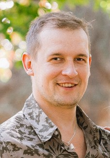

# Alexandr Zhuykov
Student of RS School



## contacts 

__e-mail:__ Sashik-84@mail.ru\
__phone number:__ +7(912)012-8999

### personal information

My goal is to gain knowledge and reach a professional level
in programming. 
I want to become a JavaScript front-end developer.
Technical mindset. Diversified and regularly improve myself
Ready to new knowledge and experience.

### skills

learning javascript

### code example

in JavaScript:
```
let i;
for (i=0; i<5; i++) {
  console.log(i);
}
```

### experience

no much

### education

`2001-2004`
Faculty of Computer Science, 
Izhevsk State Technical University, specialty technician.

### english

A0
